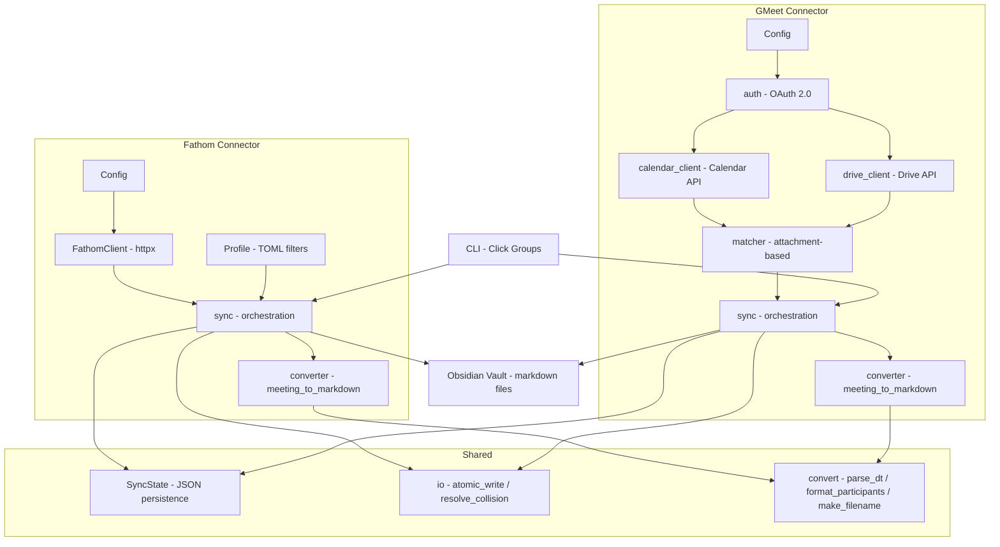

# Design: Meeting Export

## Overview

Meeting Export is a Python CLI built with Click that uses a connector-based architecture to pull meeting data from multiple sources and normalize it into markdown with YAML frontmatter. Each connector encapsulates its source-specific logic (authentication, data fetching, content parsing) while sharing common infrastructure for state tracking, file I/O, and text conversion.

**Key design decisions:**

- **Connector isolation**: Fathom and GMeet connectors share zero runtime state — each has its own config, state file, and output subdirectory. Adding a new source means adding a new package under `src/meeting_export/`.
- **Attachment-based matching (GMeet)**: Calendar event attachments provide a direct `fileId` link to Gemini notes or manual notes docs, avoiding unreliable Drive title searches that can match wrong occurrences of recurring meetings.
- **Atomic writes**: All file output uses temp-file-then-rename to prevent corrupt partial files in the Obsidian vault (which is synced via iCloud).
- **Incremental sync via JSON state**: A simple JSON file per connector tracks exported meeting IDs, enabling cheap idempotent re-runs without re-fetching content.

## Architecture



## Components

### CLI Layer (`cli.py`)

**Responsibility**: Parse arguments, load config, delegate to connector sync functions, display results.

```
meeting-export
├── -v/--verbose                    # Debug logging
├── fathom                          # Fathom subgroup
│   ├── sync [options]              # Main export command
│   ├── list [options]              # Preview available meetings
│   ├── export <recording_id>       # Single meeting export
│   ├── status                      # Show sync state
│   └── reset                       # Clear sync state
└── gmeet                           # Google Meet subgroup
    ├── auth                        # OAuth flow
    ├── sync [options]              # Main export command
    ├── list [options]              # Preview calendar events
    ├── status                      # Show sync state
    └── reset                       # Clear sync state
```

**Interface**: Each `sync` command returns a `SyncResult` with counts (exported, skipped, no_transcript, errors). CLI formats and prints the summary.

### Shared: SyncState (`shared/state.py`)

**Responsibility**: Track which meetings have been exported to enable incremental syncs.

```typescript
interface SyncState {
  version: 1;                        // Schema version
  last_sync_at: string;              // ISO 8601 timestamp
  exported: Record<string, {         // Keyed by meeting/event ID
    title: string;
    exported_at: string;             // ISO 8601
    file_path: string;               // Relative path in vault
    [key: string]: unknown;          // Connector-specific extras (e.g., drive_doc_id)
  }>;
}
```

**Persistence**: JSON file, written on each successful export. One file per connector (``.fathom-export-state.json``, ``.gmeet-export-state.json``).

### Shared: File I/O (`shared/io.py`)

**Responsibility**: Safe file operations for writing into an iCloud-synced Obsidian vault.

- `atomic_write(path, content)` — Write to `{path}.tmp`, then `os.rename()`. Prevents partial reads by Obsidian or iCloud sync.
- `resolve_collision(path)` — If `path` exists, try `path (2).md`, `path (3).md`, etc.
- `sanitize_filename(name)` — Strip `\/:*?"<>|` characters.

### Shared: Conversion Helpers (`shared/convert.py`)

**Responsibility**: Date parsing, duration formatting, participant rendering, filename generation.

- `parse_dt(s)` — Try 7 ISO/custom formats, return `datetime | None`.
- `compute_duration(start, end)` — Return human-readable string (`"1h 15min"` or `"42 min"`).
- `format_participants(invitees)` — Render `"Name <email>"` list from attendee dicts.
- `make_filename(title, date_str)` — Return `"YYYY-MM-DD - Sanitized Title.md"`.
- `yaml_escape(s)` — Escape `\` and `"` for YAML frontmatter strings.

### Fathom: Client (`fathom/client.py`)

**Responsibility**: HTTP communication with the Fathom API, including pagination, rate limiting, and retry.

- Context manager (`with FathomClient(config) as client`).
- `list_meetings(...)` — Generator with cursor-based pagination. Supports server-side filters: `recorded_by[]`, `calendar_invitees_domains[]`.
- `get_transcript(recording_id)` / `get_summary(recording_id)` — Fetch meeting details.
- Rate limiting: sliding-window deque of request timestamps, configurable RPM.
- Retry: exponential backoff (2^n seconds), max 3 attempts, respects `RateLimit-Reset` header on 429.

### Fathom: Profile (`fathom/profile.py`)

**Responsibility**: TOML-based filtering for participant emails and title keywords.

```toml
[participants]
include = ["*@company.com"]
exclude = ["noreply@company.com"]

[title]
include = ["Strategy"]
exclude = ["Interview"]
```

- Wildcard matching: `*@domain.com` matches any email from that domain.
- Partial matching: `"john"` matches `john.doe@company.com` or display name containing "john".
- `api_domains` property: extracts pure domain wildcards for server-side optimization.

### Fathom: Converter (`fathom/converter.py`)

**Responsibility**: Transform Fathom meeting dict into markdown with YAML frontmatter.

**Sections**: Summary (with rewritten Fathom timestamp links → Obsidian block refs `^t-N`), Action Items (checkbox list with assignees), Transcript (speaker + timestamp + block anchors).

### Fathom: Sync (`fathom/sync.py`)

**Responsibility**: Orchestrate the Fathom export pipeline.

```
Load state → List meetings (with filters) → Skip exported
→ Apply title/profile filters → Fetch transcripts
→ Convert to markdown → atomic_write → Update state
```

Supports `--batch N` mode: loops in groups of N until no new meetings found.

### GMeet: Auth (`gmeet/auth.py`)

**Responsibility**: Google OAuth 2.0 Desktop App flow.

- Scopes: `calendar.readonly`, `drive.readonly`.
- Token persistence: saved to configurable path (default `~/.gmeet-to-llmwiki/token.json`).
- Auto-refresh: if token is expired but has a refresh token, refresh silently.
- Builds `calendar` and `drive` API service objects from credentials.

### GMeet: Calendar Client (`gmeet/calendar_client.py`)

**Responsibility**: Fetch calendar events with Google Meet conference data.

- Queries `primary` calendar with `singleEvents=True`, paginated (250 per page).
- Filters: `conferenceData.conferenceSolution.name == "Google Meet"`.
- Extracts event attachments: identifies `notes_attachment` (Google Doc, preferring titles containing "Gemini") and `recording_attachment` (video).

### GMeet: Drive Client (`gmeet/drive_client.py`)

**Responsibility**: Export Google Docs as plain text.

- `export_doc_text(service, file_id)` — Export a Google Doc by ID as `text/plain`.
- Retained search functions (`find_transcript`, `find_meeting_notes`) for potential future use, but the primary flow uses attachment-based matching.

### GMeet: Matcher (`gmeet/matcher.py`)

**Responsibility**: Match calendar events to their notes content using attachment `fileId`.

**Logic:**

1. If event has no `notes_attachment` → report as `no_transcript`.
2. If attachment title contains "gemini" (case-insensitive) → export full doc, flag as Gemini.
3. If attachment is manual notes → export full doc, extract only the section matching the event date via regex (`Month DD, YYYY |` headers).
4. If extracted manual section is empty (only structural headers, no real content) → report as `no_transcript`.

### GMeet: Converter (`gmeet/converter.py`)

**Responsibility**: Transform matched event + notes text into markdown.

**Two modes based on `is_gemini` flag:**

- **Gemini notes**: Strip header block (title, date, invitees, attachment metadata), strip feedback UI ("Rate this Summary", "Helpful or Not Helpful"), render sections with `##` headings (Summary, Decisions, Next Steps, Details).
- **Manual notes**: Strip date header and attendees line, convert `Notes` / `Action items` to `###` headings, convert `* ` bullets to `- `.
- **Legacy transcripts**: Parse old-style speaker/timestamp/text format (for pre-Gemini docs). Normalize timestamps to `HH:MM:SS`.

Handles `\r\n` line endings from Google Drive export.

### GMeet: Sync (`gmeet/sync.py`)

**Responsibility**: Orchestrate the Google Meet export pipeline.

```
Get credentials → Build Calendar + Drive services
→ List Meet events → Skip exported
→ Match to transcripts (via attachments)
→ Convert to markdown → atomic_write → Update state
```

## Data Models

### Fathom Meeting (API response)

```typescript
interface FathomMeeting {
  recording_id: number;              // Unique ID
  title: string;                     // Meeting title
  recording_url: string;             // Fathom playback URL
  created_at: string;                // ISO 8601
  recorded_by: {
    name: string;
    email: string;                   // Used for --recorded-by filter
  };
  participants: Array<{
    name: string;
    email: string;
  }>;
  summary?: string;                  // AI-generated markdown summary
  action_items?: Array<{
    text: string;
    completed: boolean;
    assignees: Array<{ name: string }>;
  }>;
  transcript?: Array<{
    speaker_name: string;
    start_time: string;              // "HH:MM:SS"
    text: string;
  }>;
}
```

### GMeet Event (extracted from Calendar API)

```typescript
interface GMeetEvent {
  event_id: string;                  // Calendar event ID
  title: string;                     // Event summary
  start: string;                     // ISO 8601 datetime
  end: string;                       // ISO 8601 datetime
  attendees: Array<{
    email: string;
    name: string;
    response_status: string;         // "accepted" | "declined" | "tentative" | "needsAction"
    self: boolean;
  }>;
  organizer_email: string;
  organizer_name: string;
  meet_link: string;                 // e.g., "https://meet.google.com/abc-defg-hij"
  conference_id: string;
  calendar_link: string;             // HTML link to event
  notes_attachment: {                // From event attachments, null if none
    file_id: string;                 // Google Drive file ID
    title: string;                   // e.g., "Notes by Gemini"
    url: string;
  } | null;
  recording_attachment: {            // From event attachments, null if none
    file_id: string;
    title: string;
    url: string;
  } | null;
}
```

### Markdown Output (both connectors)

```yaml
---
title: "Meeting Title"
date: 2026-05-13
type: fathom-transcript | gmeet-transcript
source: fathom | google-meet
recording_url: "..."           # Fathom only
meet_link: "..."               # GMeet only
calendar_event_url: "..."      # GMeet only
tags:
  - fathom-transcript | gmeet-transcript
  - meeting
participants:
  - "Name <email>"
recorded_by: "Name <email>"    # Fathom only
organizer: "email"             # GMeet only
duration: "1h 15min"
---
```

## Error Handling

| Error | Source | Recovery |
|---|---|---|
| Missing API key | Fathom config | Exit with message: "FATHOM_API_KEY not set" |
| Missing client_secret.json | GMeet config | Exit with message indicating expected path |
| OAuth token expired | GMeet auth | Auto-refresh via refresh token; if that fails, re-run auth flow |
| HTTP 429 rate limit | Fathom client | Wait `RateLimit-Reset` seconds, retry up to 3 times |
| HTTP 5xx / transport error | Fathom client | Exponential backoff retry (2^n), max 3 attempts |
| Drive export failure | GMeet matcher | Log warning, skip event, increment error count, continue |
| Corrupt state file | SyncState | Log warning, start fresh (empty state) |
| File name collision | io.py | Append `(2)`, `(3)`, etc. |
| Partial file write | io.py | Prevented by atomic write (temp + rename) |

## Testing Strategy

| Category | Coverage |
|---|---|
| **Unit: Fathom client** | HTTP mocking with pytest-httpx: pagination, auth headers, retry behavior |
| **Unit: Fathom converter** | Frontmatter generation, section rendering, link rewriting, block anchors, filename sanitization |
| **Unit: SyncState** | Fresh init, mark/check exported, persistence, reset, corrupt file recovery |
| **Unit: Profile** | TOML loading, wildcard/domain matching, title filters, `api_domains` extraction |
| **Integration** | Manual: `meeting-export {connector} sync --dry-run` against live APIs |

GMeet connector tests are not yet implemented (requires Google API mocking).
